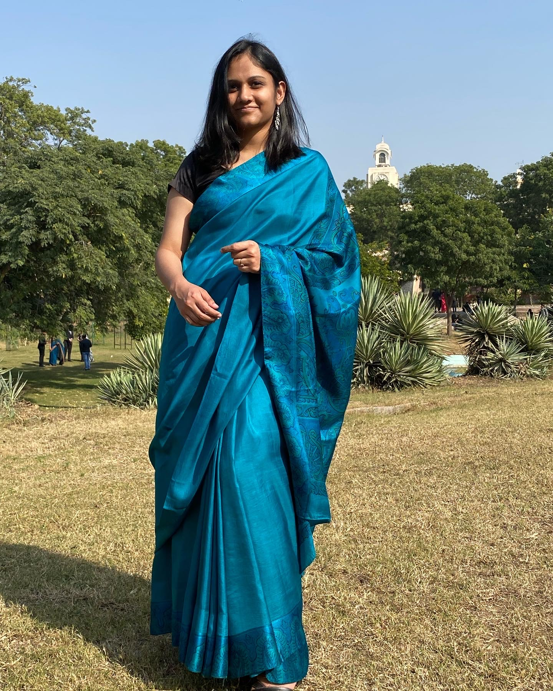

## About Me

Hi! I am Megh. I am a computer science engineering graduate from Birla Institute of Technology and Science (BITS), Pilani. I am broadly interested in Natural Language Processing, particularly in dialogue systems, question answering systems and conversational AI.

I am currently working as a machine learning engineer at [Avaamo](https://avaamo.ai/) on conversational intelligence, focusing on speech synthesis and tabular question answering.

Alongside, I am working as a research assistant at the [NTU-NLP](https://ntunlpsg.github.io/) group under [Dr. Shafiq Joty](https://raihanjoty.github.io/) and [Dr. Enamul Hoque](https://www.yorku.ca/enamulh/) on graph-to-text models for large-scale pre-training of knowledge-infused chart representations. I previously worked on combining text and graph encoders to effectively leverage text and knowledge base information for open-domain question answering.

I am also working as a research assistant at [MIDAS](https://midas.iiitd.edu.in/), IIIT Delhi. My work mainly focuses on exploring and optimizing interpolative augmentation methods in different geometrical representation spaces and in the multilingual embedding space.

In my final year of undergrad, I worked as a research intern under [Prof. Chng Eng-Siong](https://www.ntu.edu.sg/home/aseschng/) at [Nanyang Technological University](https://www.ntu.edu.sg/Pages/home.aspx). I worked on an API gateway for various modules already developed at the lab, such as SUD, NER and summarization. For the gateway, I also made a simple CNN architecture to detect emotion from speech.

I previously worked under [Prof. Chris Biemann](https://www.inf.uni-hamburg.de/en/inst/ab/lt/people/chris-biemann.html) at the [Language Technology Lab](https://www.inf.uni-hamburg.de/en/inst/ab/lt/home.html) in [Universität Hamburg](https://www.uni-hamburg.de/en.html), as a scholar of the [DAAD-WISE](https://www.daad.de/deutschland/stipendium/datenbank/en/21148-scholarship-database/?daad=1&detail=50015295&origin=4&page=1&q=wise&status=1&subjectGrps=) scholarship. I worked on query-autocompletion for unseen prefixes, mostly experimenting with using contextualized embeddings to better capture the sense. Details can be found in my résumé/CV or under the projects section. 

In my sophomore year, I was lucky to get selected for [Google Summer of Code, 2018](https://summerofcode.withgoogle.com/archive/2018/projects/6278298501906432/) as a part of the amazing [BioJS](biojs.net) community. I was mentored by [Rowland Mosbergen](https://twitter.com/rowlandm?ref_src=twsrc%5Egoogle%7Ctwcamp%5Eserp%7Ctwgr%5Eauthor), [Yo Yehudi](http://yo-yehudi.com/) and [Dennis Schwartz](https://uk.linkedin.com/in/dennis-schwartz-093315b3). 

I have interned at [Indian Institute of Remote Sensing](https://www.iirs.gov.in/), a research centre of [Indian Space Research Organization (ISRO)](https://www.isro.gov.in/), where I worked on a flight planning software for a UAV.

I am a huge fan of travelling, mostly travelling cheap and light. I was able to travel 21 countries before I turned 21 years old (Nov 19)! I am also a huge fan of electronic music, having attended [Tomorrowland, 2019](http://tomorrowland.com) and [Airbeat One, 2019](http://www.airbeat-one.de)!!!

---

## Research Interest

My research interests primarily lie in the field of machine learning and artificial intelligence, as well as their applications. I am fascinated by the **human language** and pretty much everything related to it, though I am slightly inclined towards researching on language as a tool for **human-computer interaction** and that sparks my interest in **dialogue systems and question answering models**. I have also developed an interest in **multimodal learning**, researching at the intersection of natural language processing and computer vision.

---

## Positions of Responsibility

Post | Organization | Duration
--- | --- | ---
Core Member | [Council of Students for Academic Activities](https://www.linkedin.com/in/costaa-apogee-bits-pilani-1b2267187/) | April 2018 - March 2019
Member | Student Faculty Council | August 2017 - December 2017

---
You can find the full source code of this site on [GitHub](https://github.com/Megh-Thakkar/Megh-Thakkar.github.io)

---
